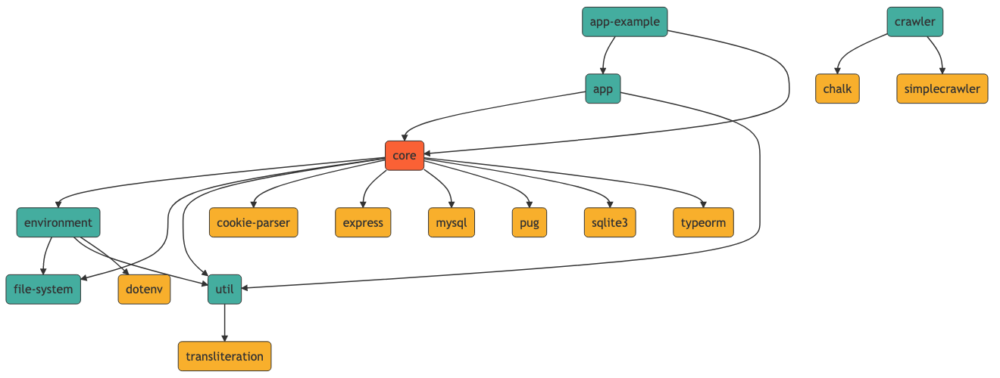

     

# vokus

  

vokus is a nodejs framework written in typescript for web and console applications and a set of reusable components.

## Package Overview
 

## TODO:

* check problem with 443 port using in tests
* integrate webpack